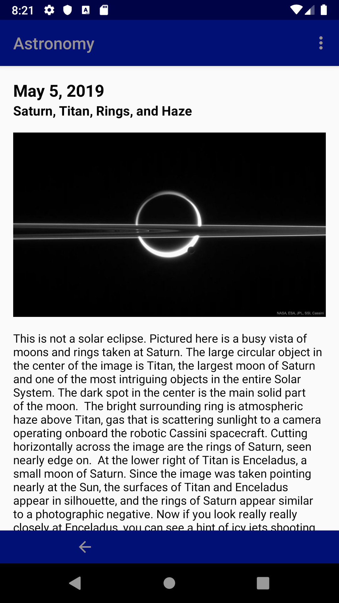
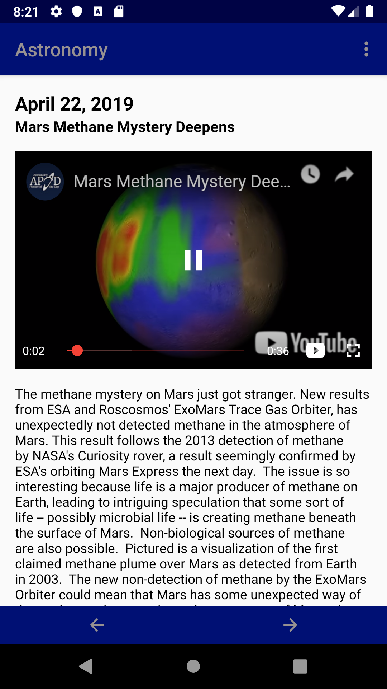
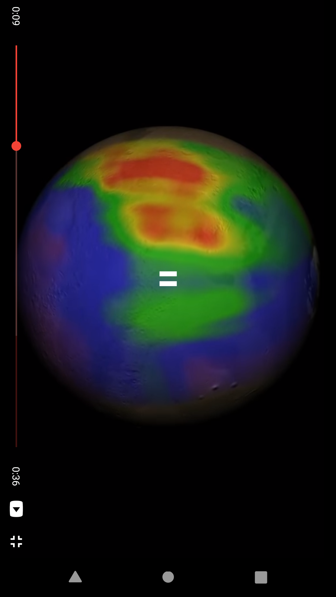
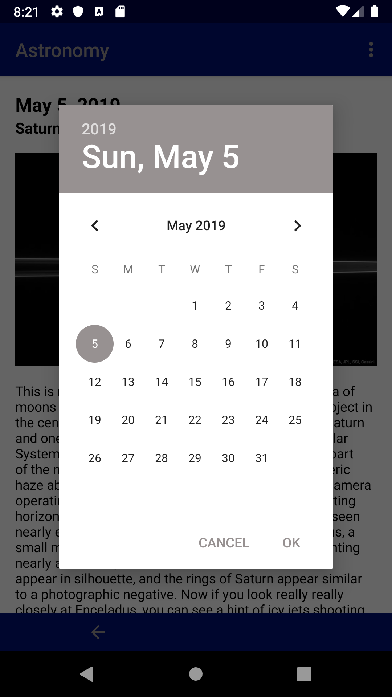

# Astronomy

This is an Android app to display the NASA [Astronomy Picture of the Day](https://apod.nasa.gov/apod/astropix.html).

The app initially displays the current day's image/video and associated information. 

| Image | Video | Fullscreen Video |
|:-----:|:-----:|:----------------:|
|  |  |  |

The user can also choose a different date.

| Change Date | 
|:-----------:|
  |
